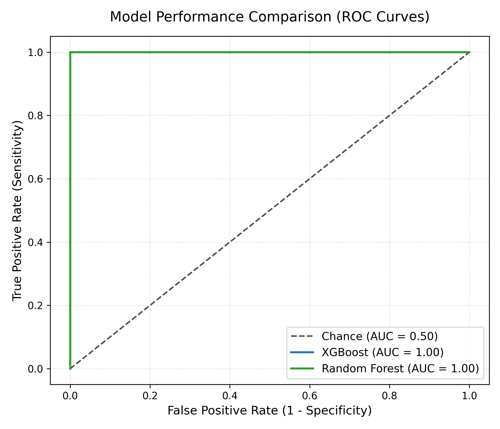
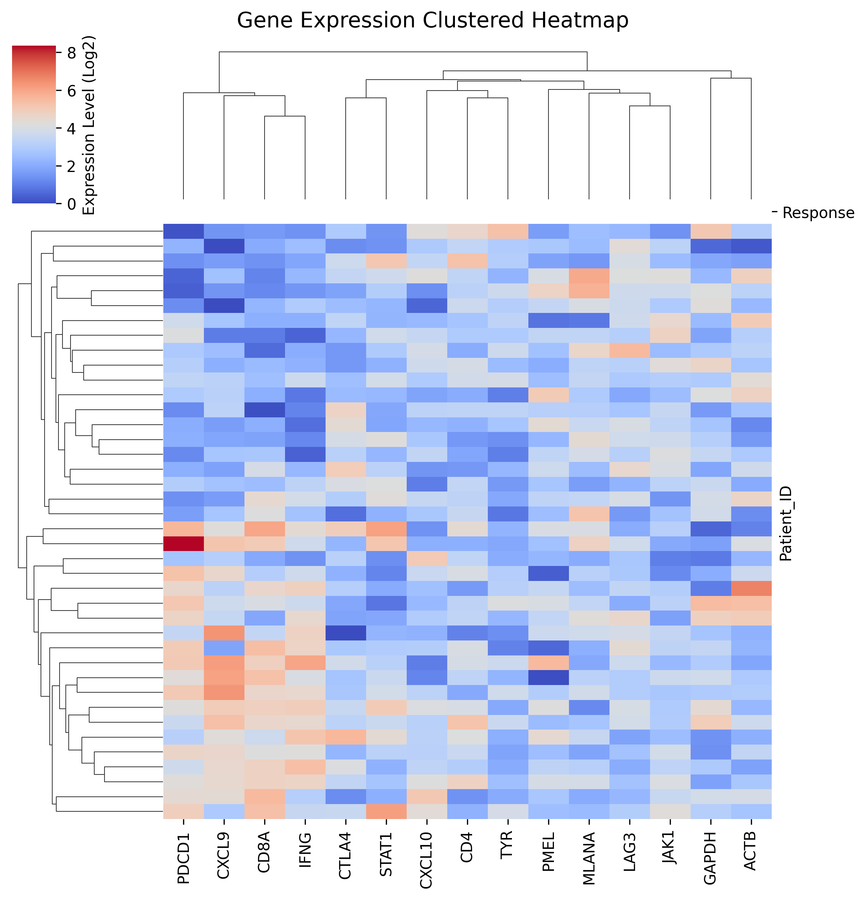
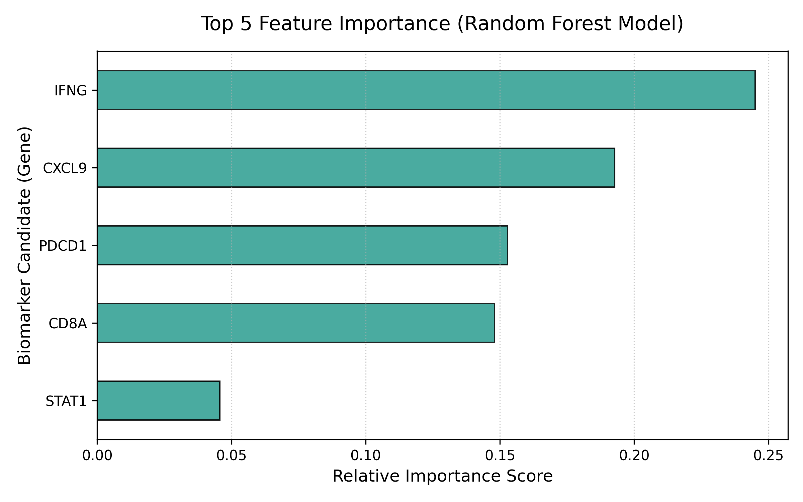
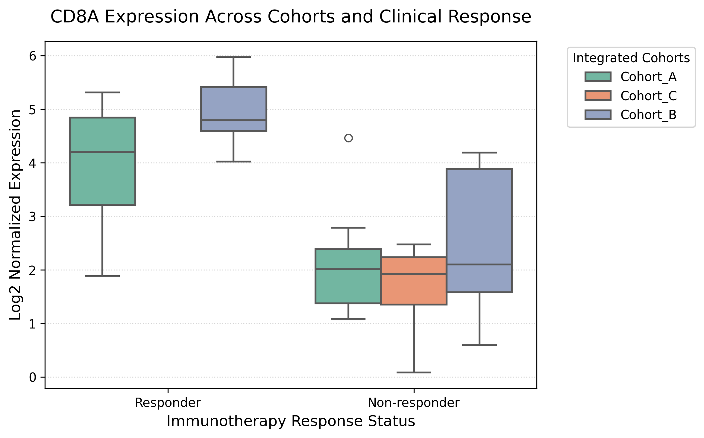

# Integrative Bioinformatics & Machine Learning Pipeline

Este repositório contém um pipeline de bioinformática ponta a ponta (*end-to-end*) focado na análise de dados transcriptómicos e na construção de modelos de Machine Learning (ML) para a predição de resposta terapêutica à imunoterapia. 

O fluxo integra o processamento inicial e manipulação de metadados clínicos em **R (Seurat v5)** com a modelação preditiva e extração de biomarcadores em **Python (Scikit-Learn / XGBoost)**.

> **Nota:** Todos os dados incluídos na pasta `data/` são 100% fictícios e simulados de forma programática apenas para demonstração das funcionalidades e validação técnica dos scripts.

---

## 🚀 Funcionalidades do Pipeline

* **Estruturação em Seurat v5 (R):** Demonstração de inicialização e manipulação de objetos da classe `Seurat`, aplicando boas práticas de otimização de memória (conversão para matrizes esparsas `dgCMatrix`).
* **Gestão Estrita de Conflitos (R):** Utilização do pacote `conflicted` para travar o ambiente de produção contra sobreposição de funções comuns (ex: `dplyr::filter` vs `stats::filter`).
* **Modelação Preditiva (Python):** Pipeline estatístico robusto utilizando os algoritmos **Random Forest** e **XGBoost** com validação estatística estratificada (*Stratified Train/Test Split*) para predição de classes ("Responder" vs "Non-responder").
* **Análise de Biomarcadores (Python):** Extração automatizada de *Feature Importance* para identificação dos principais alvos génicos preditivos.
* **Exportação Modular de Gráficos:** Geração e salvamento automático de figuras analíticas independentes em alta resolução (300 DPI).

---

## 📂 Estrutura do Repositório

```text
├── metadata/
│   ├── mock_metadata.csv               # Metadados clínicos simulados (ID, Cohort, Response)
│   ├── mock_expression.csv             # Matriz de expressão génica simulada (Log2)
│   └── processed_expression_for_ml.csv # Matriz integrada exportada pelo R para o Python
├── scripts/
│   ├── 01_preprocessing.R              # Script R: Carregamento, Seurat e integração Tidyverse
│   └── 02_ml_classification.py         # Script Python: Treino, avaliação e exportação de figuras
├── results/                            # Diretório gerado automaticamente com os resultados
│   ├── roc_curves.png                  # Comparação de performance dos modelos (AUC)
│   ├── heatmap_clustered.png           # Agrupamento hierárquico da assinatura génica
│   ├── feature_importance.png          # Ranking dos genes mais importantes
│   └── cohort_expression_boxplot.png   # Validação do biomarcador principal por Cohort
├── requirements.txt                    # Dependências do ambiente Python
└── README.md                           # Documentação do projeto

```

## A. Avaliação de Performance dos Modelos

A Curva ROC compara a sensibilidade e especificidade do Random Forest e do XGBoost, calculando a área abaixo da curva (AUC) para determinar o melhor preditor.



## B. Perfil de Expressão e Agrupamento Hierárquico

O mapa de calor (Clustermap) agrupa os pacientes e genes por similaridade transcriptómica, destacando visualmente a assinatura diferencial entre pacientes "Respondedores" (Teal) e "Não-Respondedores" (Orange).



## C. Importância Relativa das Features

O ranking quantifica o peso estatístico que o modelo Random Forest atribuiu aos 5 genes mais cruciais no momento de decidir se um paciente responderia ou não à terapia.



## D. Validação Cruzada entre Cohorts

O boxplot do biomarcador principal (CD8A) serve para monitorizar o efeito de lote (batch effect), validando se o comportamento biológico do gene é consistente e estável entre todas as diferentes cohorts integradas no pipeline.



## Citation

Hao, Y., Stuart, T., Kowalski, M.H. et al. Dictionary learning for integrative, multimodal and scalable single-cell analysis. Nat Biotechnol 42, 293–304 (2024). https://doi.org/10.1038/s41587-023-01767-y

